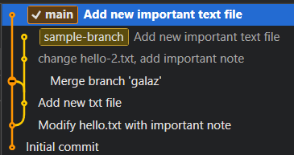

# *Git Workshops* at infoShare Academy

👨‍🏫 Dominik Młynarczyk | 📧 [hello@dominikmlynarczyk.com](mailto:hello@dominikmlynarczyk.com)

## Garść linków na dzień dobry 🧐

1. [Dokumentacja Gita](https://git-scm.com/doc)
2. [Learn Git Branching](https://learngitbranching.js.org/?locale=pl) - fajny *tutorial* wizualizujący pracę z Gitem w kontekście gałęzi i *mergowania*
3. [Resources to learn Git](https://try.github.io/) - więcej materiałów do nauki Gita
4. [Git Guts - JustJoin.IT](https://www.youtube.com/watch?v=bfmVOYaKoVI) - fajny materiał pokazujący Gita "od środka"

## Git 🧠

GIT jest to tzw. **rozproszony system kontroli wersji, (\*ang. DVCS\* - \*Distributed Version Control System\***). GIT powstał 7 kwietnia 2005 roku, a jego autorem jest *Linus Torvalds* który także jest twórcą jądra Linuxa. Chcąc historycznie poznać rozwój Gita i zrozumieć ideę powstania tego narzędzia idealnym źródłem na start jest jego wystąpienie pod [tym linkiem (Google Tech Talk: Linus Torvalds on git, maj 2007)](https://www.youtube.com/watch?v=4XpnKHJAok8), gdzie mocno krytykuje systemy scentralizowane.

## Wymagane narzędzia 🔨

W ramach dzisiejszych zajęć będziemy potrzebować:

- [Gita](https://git-scm.com/)
- [Visual Studio Code](https://code.visualstudio.com/)

W ramach zajęć będziemy pracować albo z plikiem HTML, albo z plikiem Markdown (o rozszerzeniu `.md`). Jeżeli nie znasz języka *Markdown* [tutaj](https://www.markdownguide.org/cheat-sheet/) znajdziesz ściągawkę.

## Podstawowe komendy linii poleceń 💻

Przygodę w linii poleceń (potocznie *terminalu*) zaczynamy domyślnie zawsze w folderze domowym i jaki to jest folder zależy od systemu z jakiego korzystamy. 

Aby poznać ścieżkę folderu domowego, czy katalogu w jakim się znajdujemy używamy komendy:

```bash
pwd
```

Przykładowo, na macOS będzie to katalog `/Users/nazwa_usera` np. `/Users/admin`. Komenda `pwd` to skrót od słów *Print Working Directory* i jej celem jest poinformowanie w jakiej lokalizacji aktualnie jesteśmy.

Aby "rozejrzeć" się po katalogu w którym się znajdujemy, czyli zobaczyć jego zawartość wykorzystujemy komendę:

```bash
ls
```

Zobaczymy dzięki niej wszystkie foldery i pliki w katalogu w którym aktualnie się znajdujemy.

Nie zobaczymy jednak ukrytych folderów i plików, czyli tych których nazwa na ogół jest poprzedzona kropką i aby je wyświetlić używamy komendy `ls` z przełącznikiem `-a`:

```bash
ls -a
```

------

By utworzyć nowy folder z poziomu katalogu w którym aktualnie jesteśmy używamy komendy:

```bash
mkdir moj-katalog
```

Powyżej utworzyliśmy folder o nazwie *moj-katalog*. Nazwa komendy `mkdir` pochodzi od angielskiego *"Make directory"*, czyli utwórz katalog. Chcąc się upewnić, że taki folder stworzyliśmy wystarczy go wylistować za pomocą poznanej komendy `ls`.

Aby wejść do wyżej utworzonego katalogu używamy komendy:

```bash
cd moj-katalog
```

Po prostu po komendzie `cd` podajemy ścieżkę do konkretnego katalogu pod który chcemy przejść.

Komenda `cd` pochodzi od słów *Change Directory*, czyli zmień katalog.

Chcąc wrócić do folderu nadrzędnego jako ścieżkę podajemy dwie kropki:

```bash
cd ..
```

W systemach *UNIX'owych* aktualny folder jest oznaczany kropką, a dwie kropki to folder rodzic. Tym samym chcąc przejść kilka poziomów wyżej piszemy:

```bash
# przejście trzy foldery wyżej
cd ../../../
```

Jeżeli chcemy wrócić do poprzedniego folderu w prosty sposób, możemy wykorzystać komendę:

```bash
cd -
```

------

Używając komendy `ls` w katalogu *moj-katalog* nie zobaczymy nic, bo jest to pusty, dopiero co utworzony katalog.  Aby stworzyć plik w katalogu *moj-katalog* używamy komendy:

```bash
touch plik-testowy.txt
```

Dzięki temu w katalogu *moj-katalog* utworzyliśmy plik `plik-testowy.txt` i na dowód znów możemy użyć komendy `ls`.

------

Usuwanie realizujemy za pomocą komendy:

```bash
rm nazwa-pliku
```

`rm` to skrót od `remove`. Chcąc usuwać katalogi należy użyć powyższej komendy z przełącznikiem `-r`, ponieważ `-r` oznacza `recursive`, czyli usuwamy folder i rekursywnie całą jego zawartość.

# 🏠 Praca lokalna z repozytorium

Poniżej znajdują się materiały i ćwiczenia do wykonania, które pozwolą Ci opanować podstawy pracy z Gitem.


## Challenge 1 - Podstawowa konfiguracja *Gita*

Zanim zaczniemy pracę z Gitem, warto się gitowi przedstawić 😊. Wprowadź do linii poleceń następujące komendy (oczywiście podając swoje imię i nazwisko oraz swój adres e-mail):

```bash
git config --global user.name "Adam Nowak"
git config --global user.email "adam.nowak@example.com"
```

Powyższe informacje będą wykorzystane do zapisania naszych zmian w historii projektu. Dzięki temu wiadomo kto dane zmiany wprowadził i jak się z autorem zmian skontaktować. 

`user.name` oraz `user.email` to klucze pod którymi Git zapamiętuje daną wartość konfiguracji.

Wykorzystaliśmy przełącznik `--global` by skonfigurować gita w kontekście całego użytkownika w systemie operacyjnym, co oznacza, że powyższe ustawienia będą zaaplikowane dla dowolnego [repozytorium](https://chcenawczoraj.pl/software/czym-jest-repozytorium-kodu-strony) na Twoim komputerze. 

Dodaj jeszcze następującą konfigurację:

```bash
git config --global core.editor "code --wait"
git config --global credential.helper "cache --timeout=3600"
```

Program [Vim](https://www.vim.org/) jest to domyślny edytor tekstowy w Gicie i jest on trochę skomplikowany, szczególnie dla osób początkujących. Zmieniamy go za pomocą klucza `core.editor` ustawiając go na *VIsual Studio Code*. Przełącznik `--wait` będzie kazał oczekiwać Gitowi za każdym razem jak otworzony zostanie *Visual Studio Code* na potwierdzenie realizowanej operacji.

Dodatkowo, wybiegając nieco w przyszłość, dodamy klucz `credential.helper`. Podczas komunikacji ze zdalnym repozytorium (o czym powiemy więcej później) będziemy często używać protokołu HTTPS. Wymaga on podawania loginu i hasła. Aby nie musieć tego podawać za każdą operacją przesyłania danych do zdalnego repozytorium możemy na określony czas zapamiętać dane uwierzytelniające na poziomie systemu operacyjnego.

------

Aby zweryfikować czy Git faktycznie zapisał nasze ustawienia konfiguracyjne posłużymy się tymi samymi komendami, tylko w trybie do odczytu:

```bash
# Przykłady
git config user.name
git config user.email
```

Możemy też wypisać wszystkie ustawienia konfiguracyjne w następujący sposób:

```bash
git config --list
# lub wersja skrócona
git config -l
```

Możemy też podejrzeć jak wygląda globalna konfiguracja *Gita* za pomocą komendy:

```bash
git config --global -e
```

<u>Jeżeli widzisz tam wprowadzone przez siebie zmiany konfiguracyjne, to wykonałeś/aś wszystko poprawie!</u>

> Jeżeli będziesz potrzebować szybkiego opisu często używanych komend wpisz w linii poleceń:
>
> ```bash
> git help
> ```

## Challenge 2 - Początek pracy, tworzymy repozytorium

Początek pracy z GITem zaczyna się od utworzenia <u>repozytorium</u>. 

**Repozytorium (potocznie: repo) to <u>katalog</u> **(znajdujący się np. na naszym dysku twardym) zawierający wszystkie informacje o aktualnym stanie projektu i jego historii. Twoje repozytorium może zawierać odwołania (linki) do innych repozytoriów (co zobaczymy w ramach pracy zdalnej).

**Twoim zadaniem będzie utworzenie repozytorium na dysku**. Aby zainicjować nowe repozytorium należy:

1. Utworzyć katalog za pomocą komendy `mkdir`
2. Wejść do niego za pomocą komendy `cd`
3. Zainicjować nowe repozytorium za pomocą komendy `git init` - **komenda ta w dowolnie wybranym katalogu tworzy lokalne repozytorium GITa**.

<u>Na tym etapie GIT jest gotowy do pracy :blush:</u>

------

Dzięki komendzie `git init` GIT utworzył w wybranym przez nas katalogu swój własny, **ukryty katalog** o nazwie *.git*, w nim będą znajdować się wszystkie informacje o repozytorium. W tym katalogu znajdują się głównie pliki tekstowe i możemy otworzyć je w dowolnym edytorze.

Struktura katalogowa wygląda następująco:

```
.git
└───branches/ (empty)
└───hooks/ 
|   └───applypatch-msg.sample
│   └───commit-msg.sample
│   └───fsmonitor-watchman.sample
│   └───post-update.sample
|   └───pre-applypatch.sample
│   └───pre-commit.sample
│   └───prepare-commit-msg.sample
│   └───pre-push.sample
│   └───pre-rebase.sample
│   └───pre-receive.sample
│   └───update.sample
└───info/
|   └───exclude
└───objects/
|   └───info/ (empty)
|   └───pack/ (empty)
└───refs/
|   └───heads/ (empty)
|   └───tags/ (empty)
└───config
└───description
└───FETCH_HEAD
└───HEAD
```

<u>Warto już na początku przejrzeć te pliki, aby przekonać się, że nie są one aż tak straszne.</u>

## Challenge 3 - Pierwszy *commit*

**Commit** (inaczej: *changeset*, *revision*, *version*) - **stan repozytorium**, czyli **konkretna wersja projektu w danym momencie w czasie**. W Gicie wersja oznaczona jest wyliczonym identyfikatorem [SHA1](https://pl.wikipedia.org/wiki/SHA-1). 

Historia Twojego projektu będzie właśnie składać się z *commitów*. Oprócz informacji o zmienionych plikach, każdy *commit* zawiera także informacje o:

1. **autorze**, (imię i nazwisko oraz adres e-mail wcześniej skonfigurowane)
2. **czasie utworzenia zmiany**, 
3. **commit message (opis zmian)**.

Pierwszy *commit* to punkt początkowy nowego repozytorium i nazywany jest **root commit**, aby zaznaczyć, że jest to punkt startowy dla naszego repozytorium.

**Na podstawie wiedzy z zajęć utwórz swój pierwszy *commit*.**

## Challenge 4 - Zaprzyjaźniamy się z *Gitem* 

Na podstawie wiedzy z zajęć wiemy na czym polega poniższy diagram w gicie:


Przećwicz mechanizm *stage'owania* oraz *commitowania*, obserwując całe *worfklow* *Gita* za pomocą poznanych komend:

- `git add <nazwa-pliku>` - dodaje zmiany z wybranego pliku do *Staging area* (inaczej nazywany *indexem*). Możesz dodać wszystkie zmiany dodając w miejsce `<nazwa_pliku>` kropkę.
- `git commit` - komenda dobrze Ci już znana. Możesz wykorzystać przełącznik `-m` aby przekazać z poziomu linii poleceń opis *commita*.
- `git status` - pokazuje aktualny status zmian (aktualnie zmienione pliki oraz pliki znajdujące się w indeksie)

**Dodaj kilka *commitów* analizując co się dzieje kiedy wprowadzasz każdą komendę *Gita*. Na podstawie wiedzy z zajęć zajrzyj do katalogu `.git` i obserwuj co się dzieje (w szczególności skup się w ramach warsztatów na katalogu `refs` i/lub bezpośrednio na pliku `HEAD`)**

## Challenge 5 - Analiza zmian i historii

Wykorzystaj poznane komendy analizując zmiany nie śledzone oraz te aktualnie znajdujące się w *Staging area*:

- `git diff` oraz `git diff --staged` - pokazuje zmiany naniesione na plikach oraz zmiany które aktualnie znajdują się w *Staging Area*.
- `git log` - wyświetla historię projektu, można wykorzystać bardzo przydatne przełączniki do zmodyfikowania sposobu wyświetlania historii:
  - przełącznik `--oneline` - wyświetli skróconą historię projektu, gdzie każdy *commit* zajmie jedną linię w wierszu poleceń
  - przełącznik `--graph` - graficzna reprezentacja historii projektu (przyda się przy poznaniu *branchy*)
  - filtorwanie danych za pomocą `--author` celem sprawdzenia zmian od danej osoby, a także za pomoca `--after` czy `--before` celem określenia *commitów* z danego zakresu dat

## Challenge 6 - Gałęzie

**Gałąź (ang. branch)** - jest to **kopia repozytorium**, umożliwiająca pracę niezależną od pozostałych kopii (nie jest to kopia fizyczna, a jedynie koncepcyjna).

**Master** - jest to **domyślna nazwa pierwszej gałęzi** w repozytorium Gita. W innych systemach kontroli wersji nazywana jest jako *main* lub rzadziej *default*.

Mając główną gałąź (domyślnie jest to master) i gałąź np. `dev` możemy pracować na obu nie mieszając niczego ze sobą aż do chwili gdy będzie nam to potrzebne. Możemy np. rozwijać jakąś funkcjonalność na gałęzi `dev` i jednocześnie na masterze (a najlepiej na jeszcze jednej osobnej gałęzi) robić np. szybkie fixy dla wykrytych bugów.

Podstawowe komendy do pracy z gałęziami:

- `git branch` - wylistuje lokalne gałęzie 
- `git branch my-new-branch` - tworzy branch o nazwie `my-new-branch` który znajdzie się w tym samym miejscu w którym aktualnie jest nasze HEAD (miejsce w którym aktualnie się znajdujemy w historii projektu) 
- `git checkout my-other-branch` - przełącza HEAD na ostatni *commit* brancha `my-other-branch`
- `git checkout -b my-third-branch` - połączenie dwóch powyższych. Tworzy nowy branch oraz "przechodzi na niego" (zmienia HEAD)

**Twoim zadaniem będzie utworzenie nowej gałęzi, przejście na nią, a następnie wykonanie *commita*. Następnie wróć z powrotem na gałąź `main` i wykonaj komendę:**

```bash
git merge --no-ff -m "Merge branch test"
```

Omówimy dokładnie co ta komenda robi w kolejnym ćwiczeniu. 😊 Sprawdź teraz jedynie historię projektu.

## Challenge 7 - Fast-forward merge, 3-way merge i cherry-pick

Praca z *Gitem* to nieodzwone wykorzystanie gałęzi i połączenie zmian z dwóch (lub większej liczby) gałęzi co nazywamy operacją *merge*.

Wykonaj następujące operacje:

1. Jesteś na gałęzi `main` , utwórz nową gałąź i od razu na nią przejdź, na tej gałęzi dodaj zmianę, a następnie wykonaj *merge* do gałęzi `main` (w między czasie nie modyfikuj gałęzi głównej). Jaki rodzaj *merge* wykonałeś/aś i dlaczego?
2. Jesteś na gałęzi `main`, utwórz nową gałąź, nie przechodź na nią od razu tylko dodaj zmianę na gałęzi `main`. Następnie przejdź na utworzoną gałąź, wykonaj zupełnie inną zmianę (np. w zupełnie innym pliku) a następnie wykonaj *merge* do gałęzi `main` (w między czasie nie modyfikuj gałęzi głównej). Jaki rodzaj *merge* wykonałeś/aś i dlaczego?
3. Powróć na utworzoną gałąź z kroku drugiego, dodaj do niej kilka zmian, ale przenieś tylko jeden wybrany *commit* na gałąź *main*. Możesz ten *commit* dodatkowo oznaczyć tagiem *lightweight*.

Efekt Twojej pracy może wyglądać następująco:



